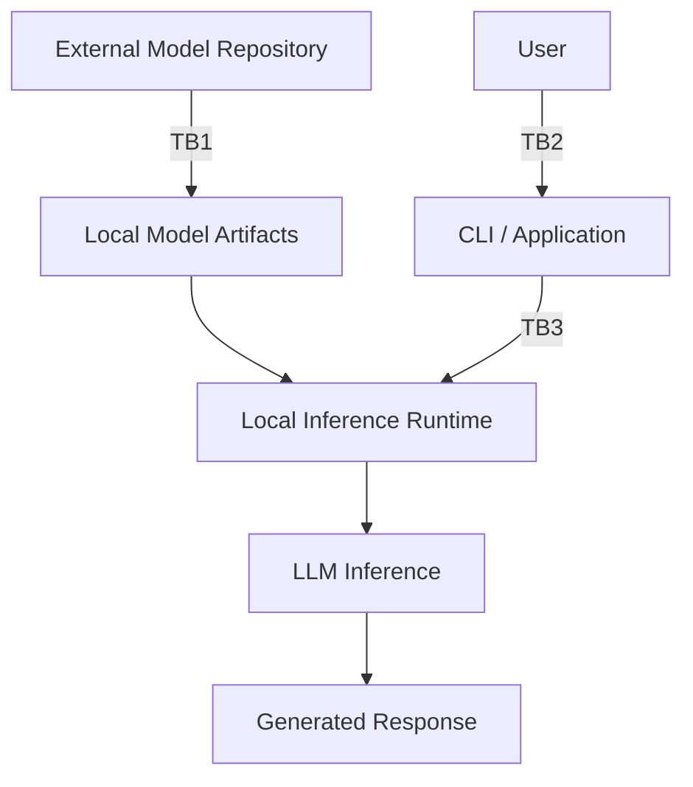

# Lab01 - Running a Local LLM

**Primary question:**  
What does it actually mean to run a Large Language Model locally, and which components, resources, and trust boundaries exist between a user prompt and the generated response?

## Purpose
This lab introduces the concept of running a Large Language Model (LLM) locally, covering:
- local LLM
- inference
- inference runtime
- model weights
- model artifacts
- local execution
- CPU execution
- generated response

Topics reserved for later labs (not deeply explained here):
- tokenization
- context windows
- quantization
- embeddings
- RAG
- agents
- MCP

**Explicitly stated:** This architecture does **NOT** yet contain:
- embedding model
- vector store
- retriever
- RAG
- agents
- MCP

## Initial Environment (Observed Facts)
- **OS:** Windows 11
- **CPU:** Intel Core i7-4510U
- **Cores:** 2
- **Logical processors:** 4
- **RAM:** approximately 16 GB
- **Graphics:** Intel integrated graphics
- **CUDA:** unavailable
- **Baseline execution mode:** CPU

These are observed facts, not hypotheses.

## Candidate Technology
**Ollama** is the candidate high-level runtime/interface for Lab01.  
Purpose: obtain a low-friction local inference baseline.

**Important distinctions:**  
Ollama is **not** the LLM itself. The stack is:

```
User
  |
  v
CLI / Application
  |
  v
Ollama service/runtime layer
  |
  v
model artifacts
  |
  v
inference
  |
  v
generated response
```

Later Lab02 will investigate inference runtimes at a lower abstraction level.

**Initial model candidate:** Llama 3.2 1B  
*Note:* Performance acceptability on this hardware **must be measured**—not assumed.

## Hypothesis
**H01 (Working Hypothesis):**  
The Windows 11 system with Intel i7-4510U and approximately 16 GB RAM can execute a small quantized LLM locally using CPU-only inference with sufficient performance for interactive experimentation.

## Architecture


- **TB1:** External model repository → local model artifacts/environment  
- **TB2:** User/input → application/local AI system  
- **TB3:** Application/CLI → local inference service/API  

## Trust Boundaries and Security (Lab01)
Identify at least:
- **TB1:** External model repository → local model artifacts/environment  
- **TB2:** User/input → application/local AI system  
- **TB3:** Application/CLI → local inference service/API  

**Questions to consider (no validated mitigations yet):**
- Where did the model originate? Who published it?
- What model artifacts were downloaded? How can integrity and provenance be checked?
- What license applies?
- What runtime/service is executing locally? Does it expose a local network API? Which interfaces can access the service?
- Does user input leave the machine?
- What logs or local artifacts may contain sensitive prompts?
- What software/dependency supply-chain risks exist?

## Learning Objectives
At the end of Lab01, we should be able to explain:
1. Difference between an LLM and an inference runtime.
2. Difference between model artifacts and executable runtime software.
3. What "local inference" means.
4. Which hardware resources are being used.
5. Where the model is stored.
6. Which processes/services execute inference.
7. Which local interfaces/API endpoints are exposed.
8. Where the first trust boundaries exist.
9. Why local execution does not automatically mean secure execution.
10. Why this is not RAG.

---
*This document is part of the local-ai-security-lab repository.*
