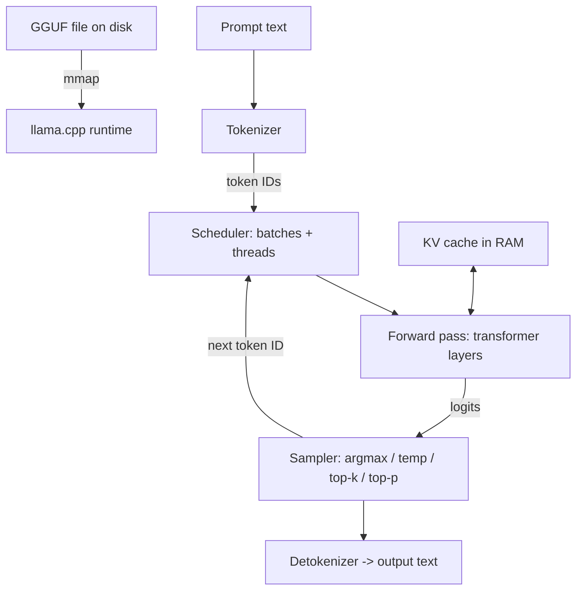
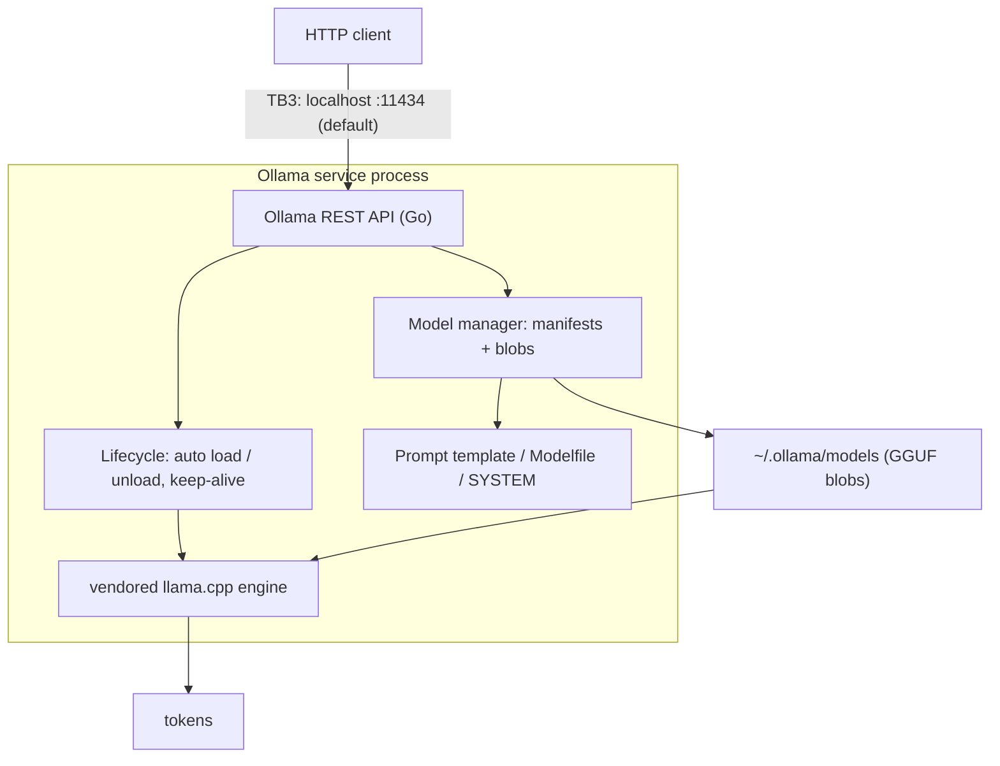

**Status:** THEORETICAL DESIGN — procedure defined, not yet executed.

# Lab02 – Understanding the Inference Runtime

**Primary question:**
What does an inference runtime actually do between a model artifact on disk and the generated tokens — and what do we gain (and give up) when we move from Ollama's convenient interface down to llama.cpp?

## Purpose

This lab studies the inference runtime as a mechanism, covering:

- responsibilities of an inference runtime: loading weights, memory-mapping model files, the token-by-token sampling loop, KV cache management, scheduling, compute backends for CPU (AVX2 / oneDNN / BLAS)
- anatomy of a GGUF model artifact: metadata header, tensor data, tokenizer section
- llama.cpp as the primary study subject: `llama-cli` vs `llama-server` and their key context parameters
- how Ollama relates to llama.cpp (decomposing the "Ollama service layer" introduced in Lab01)
- server mode and its local HTTP API as a trust boundary: localhost binding vs LAN exposure
- criteria for comparing inference runtimes (mechanism visibility, CPU performance, model format support, license)

Topics reserved for later labs (not deeply explained here):

- tokenization internals and context windows in depth (Lab03)
- generation parameters in depth (Lab03)
- quantization formats and their trade-offs (Lab04)
- formal performance benchmarking methodology (Lab05)
- model provenance verification workflows (Lab22)

**Explicitly stated:** This lab does **NOT** yet contain:

- embedding model
- vector store
- retriever
- RAG
- agents
- MCP
- any authentication layer in front of the inference API (security mitigations are deferred to Phase 4 labs)

## Environment Assumptions

Observed facts (Environment A, same as Lab01):

- **OS:** Windows 11
- **CPU:** Intel Core i7-4510U, 2 cores / 4 threads (Haswell-class; AVX2/FMA documented for this CPU — **to be verified on the machine**)
- **RAM:** ~16 GB
- **Graphics:** Intel integrated graphics; **no CUDA**
- **Execution mode:** CPU-only

Additional assumptions:

- Lab01 is assumed completed: Ollama installed, the Lab01 model pulled (candidate: Llama 3.2 1B), its GGUF blob retrievable from the local model store. Everything else (llama.cpp, HTTP client) still needs to be installed — all installs in this lab are planned steps.
- Network access to GitHub (llama.cpp releases) is available on the host.

## Candidate Technologies

Candidates under consideration; nothing here is a decision yet:

- **llama.cpp** — primary study subject. Open-source C/C++ inference engine (MIT as documented upstream; verify against the shipped copy); reads GGUF artifacts; CPU-first with optional GPU backends. Front-ends: `llama-cli` (one-shot / interactive terminal generation) and `llama-server` (HTTP, OpenAI-compatible API).
- **Ollama** (from Lab01) — re-examined not as "the runtime" but as a *service layer* around a vendored llama.cpp engine; this lab decomposes it.
- **Acquisition options for llama.cpp:** prebuilt Windows CPU-x64 release binaries vs building from source with CMake (CPU-only). Either way, version and hash must be recorded.
- **Noted for context, out of scope here:** vLLM and TensorRT-LLM (GPU-oriented, per the main README); ONNX Runtime as an alternative CPU backend (postponed).

## Prerequisites

- **Lab01 completed:** [Lab01 – Running a Local LLM](../lab01-local-llm/README.md). We reuse its Ollama installation and selected model so that "same model artifact, two runtimes" comparisons are possible.
- Planned to exist by execution time: Ollama with the Lab01 model available; llama.cpp Windows binaries (version + SHA-256 recorded); an HTTP client (Windows 11 ships `curl.exe`; verify).
- Knowledge from Lab01: the difference between an LLM and a runtime, and the trust boundaries TB1–TB3 defined there.

## Theoretical Background

### What an inference runtime actually does

An LLM is only static data (weights + tokenizer + configuration). The inference runtime is the program that turns that data into computation. At startup it must:

1. **Parse the model artifact** — read metadata (architecture, hyperparameters, tokenizer) and build an in-memory model description: layer count, tensor names, shapes, data types.
2. **Load or map weights** — make tensor data addressable, either by copying it into allocated RAM or by memory-mapping the file (see below).
3. **Allocate working memory** — compute buffers plus a KV cache sized from the requested context length.
4. **Tokenize input** and run the **autoregressive loop**: forward pass → logits → sample next token → append → repeat.
5. **Schedule work** — split prompt processing and token generation into batches mapped onto threads.
6. **Compute** — execute tensor operations (matrix multiplies, attention) via a backend; on CPU: SIMD kernels, optionally BLAS/oneDNN.
7. **Detokenize and emit** output; in server mode, wrap it in an HTTP API.



### The autoregressive loop and sampling

Each forward pass produces one vector of logits `z = (z_1, ..., z_V)` — one unnormalized score per vocabulary entry — for the *last* position. The runtime converts logits into a probability distribution and draws exactly one token:

```
p_i = exp(z_i / τ) / Σ_j exp(z_j / τ)
```

- `z_i` — logit (unnormalized score) of vocabulary entry `i`
- `p_i` — probability of selecting token `i`
- `τ` — temperature; `τ → 0` approaches greedy argmax, higher `τ` flattens the distribution
- `V` — vocabulary size

Variants: greedy (`argmax`), top-k (restrict to the k highest logits), top-p / nucleus (restrict to the smallest set with cumulative probability ≥ p). Generation parameters are Lab03's topic; here it is enough to see that the *runtime*, not the model, owns the sampling code — which is why llama.cpp exposes it as command-line flags.

Loop (simplified):

```
tokens = tokenize(prompt)
while len(tokens) < max_tokens:
    logits = forward(tokens, kv_cache)   # KV cache keeps this cheap; see below
    next   = sample(logits)
    emit(next)
    if next == EOS: break
    tokens.append(next)
```

### Anatomy of a GGUF artifact

GGUF (successor to GGML) is a single-file container designed for fast parsing and memory mapping. Its layout:

1. **Magic + version** — the bytes `GGUF` identify the format; a version field governs parsing.
2. **Metadata header** — key/value pairs: architecture name, context length, embedding dimension, block (layer) count, attention head counts, RoPE parameters, quantization version, and more. The runtime learns the model's shape from this section *without executing anything*.
3. **Tokenizer section** — also stored as metadata: tokenizer model type (e.g., BPE or SentencePiece), the token list, merges/scores. The artifact is self-contained: weights + tokenizer + configuration in one file.
4. **Tensor descriptors** — per tensor: name, number of dimensions, shape, element type (e.g., F32, F16, Q4_K), offset into the data region.
5. **Aligned tensor data blob** — raw tensor bytes, padded to an alignment boundary (typically 32 bytes) so the file can be mapped directly.

Security note that follows directly from the format: the metadata is *untrusted input parsed by native code* before any model output exists. A malformed artifact exercises the parser and the tensor-loading code — a classic memory-corruption attack surface (developed in the Security Analysis).

### Loading weights: memory mapping vs reading into RAM

Two strategies for making weights addressable:

- **Read into RAM (`--no-mmap`)**: the runtime allocates buffers and copies tensor bytes from disk. Memory footprint = full model file + KV cache + compute buffers, immediately and fixed.
- **Memory map (`mmap`, default)**: the OS maps the file's pages into the process address space; pages are fetched on demand and can be dropped under memory pressure (the OS page cache keeps hot pages resident). Benefits: fast startup (no full copy), small resident footprint when only part of the model is hot, shared page cache across processes. Costs: first-touch latency per page; throughput depends on OS paging behavior.

Dominant memory term:

```
M_weights ≈ P × (b / 8)
```

- `P` — number of model parameters
- `b` — effective bits per weight after quantization (roughly 4–5 for Q4_K_M-class formats; exact treatment in Lab04)
- `M_weights` — bytes occupied by weights on disk and in memory

This is why a ~1B model at ~4.5 bits/weight lands around 0.5–0.7 GB: small enough for 16 GB RAM, leaving room for KV cache and the OS.

### KV cache management

Every generated token's attention keys (K) and values (V) are reused by all later tokens; recomputing them each step would make generation quadratic. The runtime stores them per layer in the KV cache:

```
M_KV = 2 × L × T × (H_kv × d) × s
```

- `L` — number of layers (blocks)
- `T` — allocated context length in tokens (not current usage)
- `H_kv` — number of key/value attention heads (≤ total heads with grouped-query attention)
- `d` — per-head dimension
- `s` — bytes per element (2 for F16; KV cache quantization is a Lab04 topic)
- leading `2` — one tensor for K, one for V

Illustrative example with hypothetical but plausible values for a ~1B model (L = 16, H_kv = 8, d = 128, F16): M_KV ≈ 64 KiB per context token, so T = 2048 costs ≈ 128 MiB and T = 8192 ≈ 512 MiB. Actual values are **to be read from the GGUF metadata** during execution and checked against the runtime's startup log (`KV self size = ... MiB`).

Management aspects: the cache is preallocated from `-c` (context size); when the context exceeds the allocation, llama.cpp either shifts/truncates the oldest tokens or refuses new ones, depending on flags; `llama-server` multiplexes the cache across parallel sequence slots (`-np`).

### Compute backends for CPU

llama.cpp executes tensor operations through ggml, which dispatches to backends:

- **CPU SIMD kernels** — the baseline: AVX2/FMA on x86-64. Our Haswell-class CPU documents AVX2; whether the installed build actually uses it is printed in the startup log and must be observed, not assumed.
- **BLAS** (OpenBLAS, MKL, ...) — accelerates large matrix multiplies, mainly during prompt ingestion.
- **oneDNN** — Intel's performance library; ggml can route operations through it on x86. Whether a given prebuilt binary includes any of these accelerations must be observed (startup log / build flags).

Key performance intuition: *token generation is memory-bandwidth bound*. Producing one token streams essentially all active weights through the CPU. Approximate ceiling:

```
throughput ≈ B_mem / M_active    (tokens per second)
```

- `B_mem` — achievable memory bandwidth in bytes/second
- `M_active` — bytes of weights touched per token (≈ M_weights for dense models)

Consequence for Environment A: with only two physical cores, adding threads stops helping once bandwidth is saturated — a prediction to test in Lab05. Prompt processing ("eval" of the prompt) is more compute-friendly (batched matrix multiplies) and scales better with threads.

### llama-cli vs llama-server

Same engine, different front-ends:

- **`llama-cli`** — terminal one-shot / interactive generation. Relevant flags (names shift slightly between versions; verify with `--help`):
  - `-m <file>` — GGUF artifact
  - `-c <n>` — context size (drives KV cache allocation)
  - `-n <n>` — max tokens to generate
  - `-t <n>` — threads
  - `-ngl <n>` — layers offloaded to GPU (0 here: CPU-only)
  - `--temp`, `--top-k`, `--top-p` — sampling
  - `--no-mmap` — force load-into-RAM instead of mapping
- **`llama-server`** — HTTP service. Same model flags plus:
  - `--host`, `--port` — bind address (documented default: loopback `127.0.0.1`; verify the "HTTP server listening" log line)
  - `-np <n>` — parallel slots (sequence multiplexing)
  - endpoints: OpenAI-compatible `/v1/chat/completions` plus native `/completion`, `/tokenize`, `/props`, ...

### Decomposing the Ollama service layer

Lab01 treated "Ollama" as a single box. Ollama's public repository shows it is a Go program that *vendors llama.cpp* as its inference engine and adds a service layer around it (to be verified locally during the procedure):



Consequences of the decomposition:

- The *model artifact format is the same* (GGUF): the blob Ollama downloaded can, in principle, be executed directly by llama.cpp. This is the empirical core of the lab and of H02.
- Ollama's defaults (context size, sampling parameters, prompt templating) are chosen for convenience and are hidden unless overridden; llama.cpp exposes the same knobs directly.
- The convenience features (process lifecycle, registry, templating) are exactly the parts that add attack surface (see Security Analysis).

### Server mode: the local HTTP API as a trust boundary

Both `llama-server` and Ollama expose an unauthenticated HTTP API by default. The bind address decides who can reach it:

- **Loopback binding (`127.0.0.1`)**: any *local process of any user* on this machine can connect. "Localhost" does not mean "only me" — it means "no remote hosts".
- **Any-address binding (`0.0.0.0`, or Ollama's `OLLAMA_HOST=0.0.0.0`)**: every host that can route to this machine (the LAN, and beyond if port-forwarded) can use the API. There is no authentication by default — whoever reaches the port can prompt the model, burn CPU/RAM (a denial of service against a 2-core machine), and read responses. Ollama's own FAQ recommends firewall rules when binding beyond loopback, which is an admission that the API itself enforces nothing.

The bind address and firewall state are therefore first-class security observations for this lab (recorded via `netstat` in the procedure).

### Criteria for comparing runtimes

Decision criteria, filled with measured values by this lab and finalized in Lab05:

| Criterion | Why it matters | llama.cpp | Ollama |
|---|---|---|---|
| Mechanism visibility | matches the bottom-up principle | direct flags, verbose logs, no hidden templating | service hides defaults |
| CPU performance on Environment A | usability | to be measured (tokens/s) | to be measured (tokens/s) |
| Model format support | artifact choice freedom | GGUF (primary) | GGUF via Modelfile import |
| License | redistribution / compliance | MIT (documented; verify at install) | MIT (documented; verify at install) |

## Hypothesis

**H02 (Working Hypothesis):**
llama.cpp can execute the same model artifact directly on CPU and exposes lower-level controls (context size, sampling parameters, memory mapping) than Ollama's default interface, at the cost of convenience.

## Procedure (Planned Steps)

> All commands are **planned, not yet executed**; flag names vary between llama.cpp versions, so verify with `--help` of the installed build.

1. **Confirm the CPU feature set** — run `llama-cli` once and record the printed feature lines (AVX2, FMA, ...). *Surprising: no AVX2 support.* (Observed)
2. **Obtain llama.cpp** — download the prebuilt Windows CPU-x64 zip from the official GitHub releases page, or build CPU-only from source with CMake. Record version, URL, and SHA-256. (Observed provenance)
3. **Locate the GGUF blob Ollama downloaded** — list `%USERPROFILE%\.ollama\models\blobs`; the manifest under `models\manifests` maps the Lab01 model tag to blob digests. The blob *is* a GGUF file. *Surprising: a non-GGUF format.* (Observed)
4. **One-shot generation with llama-cli** (planned):
   `llama-cli.exe -m <model.gguf> -p "The capital of France is" -n 32 -t 4 -c 2048 --temp 0.8`
   Record the startup log (tensor loading, mmap, KV cache size, backend flags), the generated text, and prompt-eval / generation timings. (Observed; timings to be measured)
5. **Same prompt through Ollama** — `ollama run <model>` with the same prompt and a comparable generation limit; record reported speed and total wall time. (Enables the H02 side-by-side comparison)
6. **Run llama-server** (planned): `llama-server.exe -m <model.gguf> --host 127.0.0.1 --port 8080 -c 2048`, then query `curl.exe http://127.0.0.1:8080/v1/chat/completions`. Record the "HTTP server listening" line verbatim. (Observed binding behavior)
7. **Verify who can reach the port** — with both servers running, run `netstat -ano`; record listening addresses for ports 8080 and 11434 and confirm loopback-only. Do **not** bind `0.0.0.0` in this lab; document it as a risk, not an experiment. (Observed, security-relevant)
8. **Context-size sweep** — repeat step 4 with `-c 512` and `-c 4096`; record the logged KV cache sizes and compare with the formula above. (Measured Finding)
9. **Fill the comparison table** with observed values; leave unmeasured entries as "to be measured" (formal benchmarking is Lab05's job).

## Measurement / Success Criteria

Records to keep, classified per the Evidence Classification in `LEARNING.md`:

- **Observed:** llama.cpp version and binary hash; printed CPU feature flags; GGUF metadata actually read from the artifact; `netstat` listening addresses for both servers; each server's default bind address as logged.
- **Measured Finding:** prompt-eval time and tokens/s for steps 4–5; generated-token tokens/s for both runtimes on the same prompt; KV cache bytes at `-c 512 / 2048 / 4096` vs the formula's prediction; RAM usage during generation.
- **Working Hypothesis:** H02 stands if the *same* GGUF blob runs under llama.cpp with visibly exposed controls; the "cost of convenience" is qualitative (no registry, manual flags, manual template handling) — record concrete examples.
- **Decision (deferred):** whether llama.cpp becomes the project's reference runtime for later labs is made only after Lab05's measurements.

Completion checklist:

- [ ] llama-cli generates text from the same artifact Ollama uses (step 4 output recorded).
- [ ] Startup log confirms the actual SIMD backend (AVX2 present/absent).
- [ ] llama-server answers an HTTP request from localhost; `netstat` shows loopback-only binding.
- [ ] KV cache measurements match the formula within a small tolerance, or the discrepancy is explained.
- [ ] The comparison table contains measured values or explicit "to be measured" placeholders.

## Security Analysis

Trust boundaries introduced or refined in this lab:

- **TB1** — External software source (llama.cpp release binaries or source; the Ollama installer) → local machine. Prebuilt binaries are a supply-chain dependency; hashes/signatures must be verified, not assumed. *(Refines Lab01 TB1.)*
- **TB2** — External model artifact (GGUF from a registry) → runtime parser. Metadata and tensor descriptors are parsed by native code *before* any safeguard can apply; a malformed or malicious artifact targets the parser and loader. Provenance workflows are Lab22's topic; here we only map the surface. *(Refines Lab01 TB1.)*
- **TB3** — Network client → local HTTP inference API (`llama-server`, or Ollama on `:11434`). Loopback binding admits *any local process of any user*; any-address binding admits the whole LAN. Neither server authenticates by default. *(Refines Lab01 TB3.)*
- **TB4** — Runtime ↔ on-disk state: model blobs, plus any logs or terminal scrollback containing prompts and responses, are readable by other local processes under typical desktop permissions.

Attack surface specific to this mechanism:

- Unauthenticated generation API: prompt injection is Lab17's topic, but *unauthorized access to the API itself* starts here — anyone reaching the port can spend the machine's scarce CPU/RAM or abuse the model as a free text/compute oracle.
- Binary artifact parsing: GGUF metadata, tokenizer tables, and tensor descriptors form a native-code attack surface; the plan for probing it safely (e.g., a truncated artifact) belongs to later security work and is not executed in this lab.
- Process exposure: which user context the servers run as, whether they persist after logout, and which ports are visible on the LAN.
- Prompts and responses may be written to server logs in cleartext.

Open questions (no validated mitigations yet — mitigations are evaluated in Phase 4 labs):

- Does either server implement any authentication in the version we install, or is loopback the only guard?
- Exactly what is written to logs (prompts in cleartext?)?
- On a multi-user Windows machine, which local users can connect to a loopback-bound server?
- Is the GGUF blob's integrity verified by Ollama at pull time, and does llama.cpp verify anything beyond format?
- Does binding Ollama with `OLLAMA_HOST=0.0.0.0` appear distinctly in `netstat`, and does the log emit any warning? (Documented as risky; to be observed.)

## Learning Objectives

At the end of this lab, we should be able to explain:

1. What an inference runtime does between the artifact on disk and the emitted tokens.
2. The layout of a GGUF file and which part carries weights vs tokenizer vs configuration.
3. The difference between memory-mapping and loading weights into RAM, and the trade-offs.
4. What the KV cache stores, why it exists, and how its memory scales with context length.
5. Why CPU token generation is memory-bandwidth bound, and what AVX2 / BLAS / oneDNN backends contribute.
6. The difference between `llama-cli` and `llama-server` and the key flags of each.
7. How Ollama is built on llama.cpp and which parts of Ollama are service layer vs inference engine.
8. Which runtime controls Ollama hides or pre-sets that llama.cpp exposes directly.
9. Why "listens on localhost" is a trust boundary and not a security feature, and what changes when a server binds to `0.0.0.0`.
10. Which criteria (mechanism visibility, CPU performance, format support, license) distinguish runtimes, and how to measure them.

## Navigation

---

**Previous lab:** [Lab01 – Running a Local LLM](../lab01-local-llm/README.md)
**Next lab:** [Lab03 – Tokens, Context Windows and Generation Parameters](../lab03-tokens-context-generation/README.md)

*This document is part of the local-ai-security-lab repository.*
