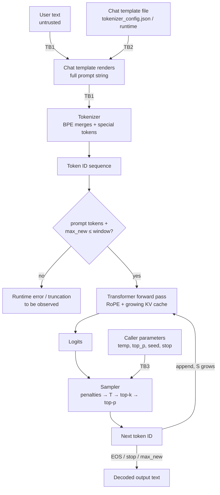

**Status:** THEORETICAL DESIGN — procedure defined, not yet executed.

# Lab03 – Tokens, Context Windows and Generation Parameters

**Primary question:**  
How does human-readable text become token IDs that a local LLM can process, what limits how many tokens fit (and at what memory cost), and which generation parameters steer the selection of each next token?

## Purpose

This lab teaches the mechanisms that sit between a prompt string and a generated response, covering:

- tokenization fundamentals (BPE, merge rules, vocabulary, token IDs, special tokens)
- counting tokens before generation
- the context window and positional information (RoPE, high level)
- KV cache and why longer context costs memory
- generation parameters: temperature, top-k, top-p, penalties, stop sequences, seed
- chat templates vs raw completion (where the template lives)

Topics reserved for later labs (not deeply explained here):

- model size and quantization (Lab04)
- systematic performance measurement methodology (Lab05)
- embeddings and similarity (Lab06 onward)
- prompt injection attacks and defenses (Lab17–Lab19) — this lab only *identifies* attack surface

**Explicitly stated:** This lab does **NOT** yet contain:

- embedding model
- vector store / retriever
- RAG pipeline (no retrieval, no chunking, no orchestration of external knowledge)
- agents or tool use
- MCP integration
- any security mitigation validated as effective (Phase 4 scope)

## Environment Assumptions

Observed facts of Environment A (not hypotheses):

- **OS:** Windows 11
- **CPU:** Intel Core i7-4510U (2 cores / 4 threads)
- **RAM:** approximately 16 GB
- **Graphics:** Intel integrated graphics; no NVIDIA CUDA GPU
- **Execution mode:** CPU-only

Additional assumptions for this lab: a small instruct-tuned model (candidate: Llama 3.2 1B, carried over from Lab01) and its tokenizer files are available locally after Lab02; a minimal Python environment (planned install) is used for tokenizer introspection.

## Candidate Technologies

Candidates to be evaluated for this lab — none of these are decisions yet:

- **The model's own tokenizer files** (`tokenizer.json`, `tokenizer_config.json`, `special_tokens_map.json`, shipped inside the model artifact): primary source of truth; mechanism-revealing because merges and special tokens are stored explicitly.
- **`tokenizers` (HuggingFace, Rust core with Python bindings)** — candidate for encoding/decoding and BPE inspection from Python scripts. Minimal and focused on the tokenizer only; not a generation framework.
- **`transformers` `AutoTokenizer` / `apply_chat_template`** — candidate for the chat-template mechanism; heavier dependency, to be weighed against raw JSON inspection.
- **llama.cpp tokenization and sampling controls** (carried over from Lab02): `--verbose-prompt` shows prompt token counts; sampling flags (`--temp`, `--top-k`, `--top-p`, `--repeat-penalty`, `--seed`) expose the parameter surface of the runtime.
- **Ollama's tokenize/parameter API** — candidate for comparison of where counts and parameters are exposed at a higher level.

Distinctions to keep: the tokenizer is **not** the LLM; the chat template is **not** the tokenizer (it lives in tokenizer config or runtime config); the runtime is **not** the model (Lab02). The tokenizer and the runtime's sampler are the two components exercised here.

## Prerequisites

- **Lab01 – Running a Local LLM** (labs/lab01-local-llm/README.md): completed or at least its model artifact is present locally.
- **Lab02 – Understanding the Inference Runtime** (labs/lab02-inference-runtime/README.md): a runtime (llama.cpp and/or Ollama, still candidates) must be installed and able to load the model — stated as a plan, not as done.
- Planned installs for this lab: a minimal Python environment with the `tokenizers` package (candidate); no installs performed at design time.

## Theoretical Background

### 1. Tokenization: text → token IDs

An LLM operates on integers, not characters. The tokenizer maps text to a sequence of token IDs and back. Modern LLMs mostly use **Byte-Pair Encoding (BPE)**, trained in two phases:

1. **Training phase** (done once by the model publisher, we only consume the result):
   - Start with a base alphabet of all 256 byte values, so *any* input — code, emoji, arbitrary bytes — can be represented.
   - Count all adjacent pairs in a large training corpus; merge the most frequent pair into a new token; repeat until the vocabulary reaches a target size `V` (commonly 32k–256k).
   - The output is an ordered list of **merge rules** (e.g., `l + e → le`, `le + est → lest`), stored in `tokenizer.json`. Encoding applies merges in the stored order.
2. **Encoding phase** (at inference time): split input into bytes, apply merges greedily by rank, look up each resulting token in the vocabulary table, emit its integer **token ID**.

Illustrative example (not a measurement): an English-heavy BPE might split `"unbelievable"` as `["un", "believ", "able"]` — three tokens, none of which is a word.

**Why a token is neither a word nor a character:** a token is a frequency-driven subword unit. Unlike a word, tokens have no linguistic status (whitespace handling means `" world"` with its leading space is often one token). Unlike a character, one token can span several characters or a whole common word. Consequences:

- There is no fixed "tokens per word" ratio; English text commonly averages on the order of ~4 characters per token, but this varies by corpus and model. **To be measured** on our own prompts in this lab.
- **Multilingual inefficiency:** BPE merges are trained on the publisher's corpus, typically English-heavy. Spanish, Arabic, or code in rare languages tokenize into *more* tokens per word (and even UTF-8 bytes can be split into byte-level tokens). This is directly relevant here: EXP01 (experiments/exp01-local-llm-baseline) includes the Spanish prompt *"Explica en dos oraciones qué es un modelo de lenguaje."* We expect it to cost measurably more tokens than the English prompts of similar length — expectation, **to be verified** in the Procedure.

**Special tokens** (e.g., `<|begin_of_text|>`, `<|im_start|>`, `<|im_end|>`, `<|end_of_text|>`): reserved IDs added *after* BPE training; normal merges never produce them. They are scaffolding: turn delimiters, document boundaries, padding. Their IDs are fixed in `tokenizer_config.json` / `special_tokens_map.json`.

### 2. Counting tokens before generation

Generation succeeds only if everything fits in the context window `W` (a model property, read from the model metadata such as `config.json` / GGUF metadata — the exact value for our artifact **to be confirmed**):

```
T_total = T_prompt + T_generated ≤ W
```

where `T_prompt` is the token count of the *fully rendered* prompt (chat template included — see §5) and `T_generated ≤ max_new_tokens`, the caller-chosen cap. Because both sides are known before generation (except early stop), the budget check is computable up front: encode first, count, then generate. Runtimes report prompt token counts (e.g., llama.cpp `--verbose-prompt`); exceeding `W` yields either a runtime error or silent truncation depending on the runtime — behavior **to be observed**.

### 3. The context window, positions, and the KV cache

**Context window** `W`: the maximum sequence length the model can attend over in one forward pass. Two mechanisms make position usable:

- **Positional information:** attention itself is position-blind (permutation-invariant over tokens), so position must be injected. Many modern models use **RoPE (Rotary Position Embeddings)**: each key/query vector's dimensions are grouped into pairs and rotated by a position-dependent angle `θ_i = base^(−2i/d_head)` for pair index `i` at position `pos`. High level: rotating by an angle that grows with position encodes *relative* distance between tokens, without storing a large positional embedding table. Beyond the trained window, positions are out-of-distribution — quality degrades even if the runtime permits longer input.

- **KV cache:** at every layer, each token produces a key vector `K` and value vector `V` that later tokens attend to. Recomputing them for the whole prefix at every step would be quadratic waste, so the runtime **caches** them. Memory for the cache:

```
M_KV = 2 × B × L × H_kv × S × d_head × s   [bytes]
```

where `2` = keys and values; `B` = batch size (concurrent sequences); `L` = number of transformer layers; `H_kv` = number of key/value heads (with Grouped-Query Attention, `H_kv < H_attn`, reducing cache); `S` = current sequence length in tokens; `d_head` = attention head dimension; `s` = bytes per element (2 for 16-bit floats).

Key scaling insight: model *weights* occupy constant memory, but `M_KV` grows **linearly with `S` and with `B`**. On a 16 GB CPU-only machine, the KV cache — not the weights — is what makes "long context" or "many concurrent requests" expensive. This links forward to Lab04 (quantization reduces weight size; KV cache dtype is a separate knob) and Lab05 (measuring the actual numbers).

### 4. Generation parameters: the selection math

Each forward pass emits raw scores (**logits**) `z_i` over the vocabulary. Sampling transforms them into the next token:

1. **Penalties** (applied to logits before sampling):
   - `repetition_penalty = r`: `z_i ← z_i / r` if token `i` already appeared, else `z_i × r` — multiplicative discouragement of repeats.
   - `presence_penalty = α`: `z_i ← z_i − α · 1[token i appeared]` — flat additive discouragement.
   - `frequency_penalty = β`: `z_i ← z_i − β · count(token i)` — discouragement proportional to how often it appeared.
2. **Temperature** `T`: `p_i = exp(z_i / T) / Σ_j exp(z_j / T)`. `T → 0` sharpens to argmax (greedy); `T = 1` is the model's native distribution; `T > 1` flattens it toward uniform.
3. **Top-k**: keep only the `k` highest-probability tokens, renormalize the distribution over them.
4. **Top-p (nucleus)**: sort tokens by probability descending; keep the smallest set whose **cumulative probability ≥ p**; renormalize. Adapts the candidate pool size to the model's confidence.
5. Sample one token from the resulting distribution; append it; repeat.

**Stop conditions:** EOS (end-of-sequence special token), a caller-defined **stop sequence** (string or token IDs matched at decode time — generation halts and the stop text itself is excluded), or `max_new_tokens` reached.

**Seed and the limits of determinism:** a fixed seed fixes only the sampler's pseudo-random number generator. On CPU, parallel matrix computations reduce partial sums in thread-dependent order; floating-point addition is not associative, so logits can differ in the last bits between runs, which sampling can amplify. Therefore even identical seed + parameters do **not** guarantee bitwise-identical output on a multi-threaded CPU runtime, and no guarantee exists across runtime versions or thread counts. Reproducibility claims must be **measured**, not assumed (tested in the Procedure).

### 5. Chat templates vs raw completion

A **base model** does raw next-token prediction on whatever text it receives. An **instruct model** is fine-tuned on transcripts wrapped in turn scaffolding, e.g.:

```
<|im_start|>user
What is the capital of France?<|im_end|>
<|im_start|>assistant
```

Sending raw user text to an instruct model silently degrades behavior, because the model expects this structure. The **chat template** is the function that renders the turns into such a string. Where it lives:

- HF ecosystem: `chat_template` field inside `tokenizer_config.json` (applied by `tokenizer.apply_chat_template`).
- llama.cpp: a `--chat-template` file/string or compiled-in default; Ollama: the `TEMPLATE` directive in the Modelfile.

The template is *data shipped with the model artifact* that shapes every prompt — a fact the Security Analysis picks up. Explicit interface for later labs: what crosses into the LLM is always **token IDs**; everything above (template, parameters) only influences which IDs.



## Hypothesis

**H03 (Working Hypothesis):**  
prompt tokens + max_new_tokens + KV cache must fit within the context window for successful generation, and generation parameters (temperature, top_p) measurably change output diversity on a small local model (to be measured, not assumed).

This is a Working Hypothesis per the Evidence Classification in `LEARNING.md`; it becomes a Measured Finding only after the Procedure below is executed and recorded.

## Procedure (Planned Steps)

All steps are **planned, not yet executed**. No results exist at design time.

1. **Confirm artifacts (planned).** Verify the model directory contains `tokenizer.json`, `tokenizer_config.json`, and the weights file, and read the context window `W` from the model metadata. Record the exact source and version of the artifact (Observed).
2. **Install minimal tooling (planned).** `pip install tokenizers` (candidate) into a fresh virtualenv. Mark: planned install, not done.
3. **Count EXP01's three prompts (planned).** Encode with the model's own tokenizer:
   - "What is the capital of France? Answer in one sentence."
   - "Explica en dos oraciones qué es un modelo de lenguaje."
   - "Explain in two sentences why multi-factor authentication reduces account compromise risk."
   Record `T_prompt` per prompt, both raw and rendered through the chat template; compare English vs Spanish tokens per word (feeds EXP01's input tables).
4. **Budget check (planned).** For each prompt compute `T_prompt + max_new_tokens` against `W` for a chosen `max_new_tokens` (e.g., 128); then deliberately exceed `W` with a long pasted text and record the runtime's exact behavior (error vs truncation).
5. **KV cache observation (planned).** Run generation at two context sizes (small vs larger `n_ctx`) on the runtime from Lab02; record peak RAM (Task Manager / runtime logs). Expected: memory grows with occupied context per the formula in §3 — magnitude **to be measured**.
6. **Parameter sweep (planned).** Fix prompt and seed; generate N ≥ 20 samples each at (T=0), (T=0.7, top_p=0.9), (T=1.3, top_p=1.0); record the number of distinct outputs per setting. Also repeat one identical run (same seed) and diff the outputs to test CPU determinism.
7. **Stop sequences (planned).** Add a stop string mid-sentence; verify generation halts and the stop text is excluded from output.

Surprising outcomes to watch for: Spanish token count *lower* than expected; runtime silently truncating instead of erroring on overflow; identical outputs across the temperature sweep (would suggest parameters not reaching the sampler, e.g., template/API mismatch).

## Measurement / Success Criteria

Records to fill in when executed, labeled per the Evidence Classification in `LEARNING.md`:

- **Observed:** tokenizer files present; `W` as shipped in metadata; runtime version; thread count used.
- **Measured Finding:** per-prompt token counts (raw and templated); English vs Spanish tokens-per-word ratio; peak RAM at two context sizes; distinct-output counts per parameter setting; determinism diff result (identical / diverged); observed overflow behavior.
- Each record must capture: hardware, model, quantization, context size, parameters, RAM/CPU usage, inputs, outputs — per the Reproducibility principle in `LEARNING.md`.

Completion checklist:

- [ ] All three EXP01 prompts have measured token counts (raw + templated).
- [ ] The inequality `T_prompt + max_new_tokens ≤ W` verified for at least one configuration, and overflow behavior observed and recorded.
- [ ] KV cache / RAM scaling measured at two context sizes.
- [ ] Temperature/top_p diversity counts recorded; H03 either supported or refuted with the numbers.
- [ ] Determinism question answered by direct observation (not assumed).
- [ ] Security observations (TB table) filled in.

## Security Analysis

Trust boundaries introduced or crossed in this lab:

- **TB1:** Untrusted user text → prompt assembly/tokenization. Input text crosses into the system that builds the rendered prompt; the user controls both the tokens produced and how many.
- **TB2:** Model-shipped configuration (tokenizer files, chat template in `tokenizer_config.json` / runtime template) → runtime. Template and special-token definitions are data from the same (unverified) provenance as the weights and are applied to every prompt.
- **TB3:** External caller → runtime parameter surface. Whatever sets temperature, top_p, seed, stop sequences, and `max_new_tokens` steers generation; if the runtime exposes a local API (Lab02), this surface may be reachable beyond the intended user.

Attack surface specific to this mechanism:

- **Special-token and delimiter injection:** user text containing strings like `<|im_end|>` or template delimiters may terminate turns early or restructure the rendered prompt (precursor to prompt injection, studied in Lab17).
- **Chat-template tampering:** a malicious or careless template is executable-ish data that reshapes every prompt; supply-chain relevance links forward to Lab22 (model provenance).
- **Context-exhaustion resource abuse:** untrusted input controls token count; oversized input can push `S` toward `W`, inflating the KV cache and RAM on a 16 GB machine (local denial-of-service).
- **Stop-sequence manipulation:** forcing early termination can truncate safety-critical output or hide content; conversely, missing stop handling can leak past the intended answer boundary.
- **False reproducibility:** trusting seed + parameters as an audit guarantee without verifying bitwise determinism on this CPU (threading nondeterminism, §4).

Questions to consider (no validated mitigations yet — Phase 4 scope):

- Can tokens be crafted that render one way to the human and decode differently to the model (homoglyphs, bidi control characters — "Trojan Source"-style)?
- Does the runtime treat special tokens in user input as inert text or as control codes, and where is that decision made?
- Can a chat template exfiltrate or alter prompts without touching the weights? How would we detect a modified template (integrity checking is only a question here)?
- What bounds token count of untrusted input before it reaches the KV cache?
- How stable are outputs across runtime versions with fixed seed — is any "reproducible log" claim we make today still true after an upgrade?

## Learning Objectives

At the end of this lab, we should be able to explain:

1. Why a token is neither a word nor a character, and what BPE merge rules are.
2. What token IDs and special tokens are, and where they are stored in the model artifact.
3. Why multilingual (e.g., Spanish) text can cost more tokens per word, and what that means on CPU-only hardware.
4. How to count tokens *before* generation and why `T_prompt + max_new_tokens ≤ W` must be checked up front.
5. What the context window is, how RoPE encodes position at a high level, and why exceeding `W` degrades behavior.
6. Why the KV cache — not the weights — scales with context length, using the formula in §3.
7. The exact math of temperature, top-k, and top-p, and the difference between repetition, presence, and frequency penalties.
8. How stop sequences terminate generation and where they are matched.
9. Why a fixed seed does not guarantee deterministic output on a multi-threaded CPU.
10. The difference between raw completion and chat-template rendering, and where the template lives.
11. Which trust boundaries (TB1–TB3) exist in this mechanism and why template/config provenance matters.
12. Why this lab is still not RAG — no retrieval, no external knowledge enters the prompt.

---

**Previous lab:** [Lab02 – Understanding the Inference Runtime](../lab02-inference-runtime/README.md)
**Next lab:** [Lab04 – Model Size and Quantization](../lab04-model-size-quantization/README.md)
*This document is part of the local-ai-security-lab repository.*
