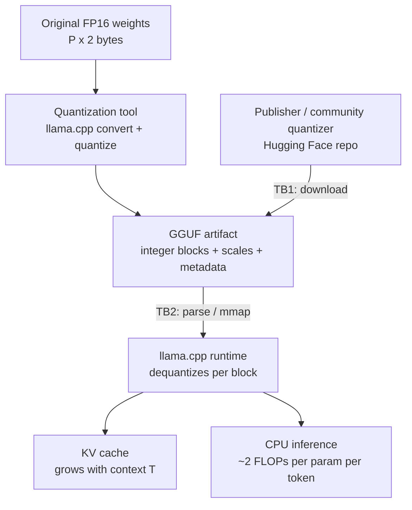

**Status:** THEORETICAL DESIGN — procedure defined, not yet executed.

# Lab04 – Model Size and Quantization

**Primary question:**
How do a model's parameter count and the number of bits used to store each weight determine its memory footprint, its decode speed on a CPU, and the quality of its output — and what must we know about the file that carries those weights?

## Purpose

This lab teaches the mechanism of model size and quantization:
- parameters vs. compute per generated token
- weight memory arithmetic (`bytes = parameters × bytes-per-weight`)
- the KV cache and its dependence on context length
- quantization theory: scales, zero-points, blocks and super-blocks
- GGML/GGUF quantization families: Q4_0, Q8_0, k-quants Q4_K_M / Q5_K_M / Q6_K
- trade-offs: artifact size vs. quality (perplexity) vs. CPU speed
- how to read model artifact filenames (parameters, quantization, publisher)
- candidate models for Environment A (**candidates only**, not decisions)
- model-artifact provenance as a first supply-chain question

Topics reserved for later labs (not deeply explained here):
- inference runtime internals and GGUF parsing mechanics (Lab02)
- tokenization, context windows, and generation parameters (Lab03)
- measurement methodology for throughput/latency (Lab05)
- embeddings, vector stores, and retrieval (Labs 06–10)
- RAG (Lab11+)
- provenance validation and supply-chain mitigations (Lab22)
- fine-tuning and QLoRA (Lab23+)

**Explicitly stated:** this lab does **NOT** yet contain:
- embedding model
- vector store / retriever
- RAG
- agents / MCP
- security mitigations (analysis only; mitigations are evaluated in Phase 4 labs)

## Environment Assumptions

Observed facts (Environment A — hardware already present):
- **OS:** Windows 11
- **CPU:** Intel Core i7-4510U, 2 cores / 4 threads
- **RAM:** ~16 GB
- **Graphics:** Intel integrated; **no CUDA** → CPU-only execution

Additional assumptions:
- No inference runtime and no model artifacts are installed yet. Every install and download in this lab is a **planned** step.
- At least ~10 GB free disk space will be needed to hold several GGUF variants side by side (to be confirmed before execution).

## Candidate Technologies

Candidates to be evaluated, not decisions:
- **llama.cpp quantization tooling** (`convert_hf_to_gguf.py`, `llama-quantize`) — mechanism-revealing way to produce and inspect quantized artifacts.
- **GGUF** — candidate artifact container format (successor to GGML). Studied because llama.cpp and most CPU runtimes consume it.
- **Hugging Face Hub** (`huggingface-cli download`) — candidate distribution channel for GGUF files.
- **Python `gguf` package / `gguf-dump`** — candidate tool to inspect GGUF headers and per-tensor quantization without loading the model.
- **imatrix (importance-matrix) calibration** — candidate technique some quantizers use to reduce quality loss at low bit-widths.

Note: Ollama (Lab01 candidate) also consumes GGUF artifacts under the hood; this lab studies the artifact layer directly.

## Prerequisites

- [Lab01 – Running a Local LLM](../lab01-local-llm/README.md) — concept of local inference and model artifacts.
- [Lab02 – Understanding the Inference Runtime](../lab02-inference-runtime/README.md) — how a runtime loads and memory-maps an artifact.
- [Lab03 – Tokens, Context Windows and Generation Parameters](../lab03-tokens-context-generation/README.md) — required for the KV cache arithmetic below.
- Planned by this point: llama.cpp available on the machine; at least one candidate GGUF artifact downloaded. Nothing is installed yet.

## Theoretical Background

### 1. Parameters vs. compute per token

A decoder-only LLM generates one token at a time. To produce a single decode token, the forward pass performs roughly one multiply-accumulate per parameter:

- **C = 2 × P** — FLOPs per decode token
  - `C` = floating-point operations per generated token
  - `P` = number of parameters
  - factor `2` = one multiply + one add per weight

This yields two upper bounds on decode speed `R` (tokens/second):

- **Compute bound:** `R ≤ F / (2 × P)`, where `F` = sustained CPU FLOP/s.
- **Memory-bandwidth bound:** `R ≤ Bw / (P × b)`, where `Bw` = sustained RAM bandwidth (bytes/s) and `b` = bytes per weight.

On a modest CPU the second bound usually dominates: every token requires reading *all* weights once, so fewer bytes per weight means proportionally fewer bytes to stream per token. Arithmetic intensity (FLOPs per byte) is fixed by `b` — roughly `2/b` FLOPs/byte — which is why quantization speeds up memory-bound decode even though it adds dequantization work.

Order-of-magnitude estimate (Working Hypothesis, **not a measurement**): if this CPU sustains on the order of tens of GFLOP/s effective, a 3B model needs ~6 GFLOPs per token (`2 × 3×10⁹`), putting a compute ceiling in the single-digit-to-low-teens tokens/second range; an 8B model roughly one-third of that. Real numbers are to be measured in Lab05.

### 2. Memory footprint: weights

- **M = P × b** — weight memory
  - `M` = bytes for the weight matrices
  - `P` = parameters
  - `b` = bytes per weight (FP16: 2; 8-bit: 1; 4-bit: 0.5)

Pure arithmetic (decimal GB, before format overhead):

| Parameters | FP16 (2 B) | Q8 (≈1 B) | Q4 (≈0.5 B) |
|------------|-----------|-----------|-------------|
| 1B  | 2.0 GB | ≈1.0 GB | ≈0.5 GB |
| 3B  | 6.0 GB | ≈3.0 GB | ≈1.5 GB |
| 8B  | 16.0 GB | ≈8.0 GB | ≈4.0 GB |

Real GGUF files run somewhat larger than the pure Q4 figure because scales/metadata add overhead and some tensors (embeddings, output) are kept at higher precision — k-quants average roughly 4.6–4.8 bits/weight at Q4_K level, which lands a 3B artifact at ~1.9–2.0 GB and an 8B artifact at ~4.5–5.0 GB. On 16 GB RAM this is the difference between "comfortable" and "workable but tight": weights are only part of the budget; the KV cache, the runtime, and the OS also need room (see below).

### 3. Memory footprint: KV cache

At inference time the model must remember keys (K) and values (V) for every token in the context, per layer:

- **KV = 2 × L × Hkv × dh × T × s** — KV cache bytes
  - `2` = one K and one V matrix per layer
  - `L` = number of layers
  - `Hkv` = number of KV heads (≤ attention heads; GQA reduces this)
  - `dh` = head dimension
  - `T` = context length in tokens (prompt + generation)
  - `s` = bytes per element (2 for FP16)

Illustrative substitution only — architecture values below are assumed, not real model specs; real `L`, `Hkv`, `dh` must be read from the model's config at execution time:

- Assume `L=36`, `Hkv=4`, `dh=128`, `s=2` → per token: `2 × 36 × 4 × 128 × 2 = 73,728 B ≈ 72 KiB`
- `T=2048` → ≈144 MiB; `T=8192` → ≈576 MiB; `T=32768` → ≈2.25 GiB

Lesson: KV cache grows linearly with context length, so the "context window" of Lab03 has a direct RAM cost, and long contexts can rival the weights in size. Total RAM ≈ weights + KV + runtime + OS. **To be measured** against reality in this lab's procedure and quantified in Lab05.

### 4. Quantization theory

Quantization represents each weight with fewer bits using integer codes plus shared conversion factors:

- **w ≈ s × (q − z)** — dequantization rule
  - `w` = approximate real weight value
  - `q` = stored integer code, in range `[0, 2^b − 1]` for `b` bits
  - `s` = scale (float; the step size between representable values)
  - `z` = zero-point (integer offset so that `w = 0` is exactly representable)

Per-tensor quantization of one global scale loses too much accuracy, so schemes use **blocks**: a group of N weights shares one scale (and sometimes a zero-point/minimum).

**GGML legacy quants:**
- **Q8_0**: 8-bit codes, blocks of 32 weights, one FP16 scale per block. Symmetric (`z = 0`). Effective ≈8.5 bits/weight with scale overhead. Near-lossless.
- **Q4_0**: 4-bit codes, blocks of 32, one FP16 scale. Symmetric. Effective ≈4.5 bits/weight. Simple and fast, but visibly lossy.
- **Q4_1**: like Q4_0 plus a per-block minimum (`m`), i.e. a zero-point: `w = s·q + m`. Slightly larger, more accurate.

**K-quants** (the modern GGUF families) fix Q4_0's quality loss with two ideas:
1. **Super-blocks**: 256 weights form a super-block of 16 sub-blocks of 16; the 16 sub-block scales are *themselves quantized* (e.g. to 6 bits) under one FP16 "super-scale". This pays for finer-grain scaling with almost no extra bytes.
2. **Mixed precision by tensor importance**: within one file, sensitive tensors (token embeddings, output projection, some attention tensors) are stored at higher precision (e.g. Q6_K) while bulk feed-forward weights stay at Q4_K. Important tensors get more bits; unimportant ones fewer.

Naming decode: `Q` = quantized; the digit = primary bit-width; `K` = k-quant super-block scheme; trailing `S`/`M`/`L` = small/medium/large variant (size/quality dial within the family). So **Q4_K_M** = "medium 4-bit k-quant"; **Q5_K_M**, **Q6_K** the same idea at 5 and 6 bits, progressively closer to Q8_0 quality at progressively larger size.

At runtime, the CPU dequantizes block by block into FP16/FP32 (or uses an 8-bit activation path) to run the dot products — dequant cost is per-weight, so it partially cancels the bandwidth win; the net effect on speed is **to be measured**, not assumed.

### 5. Trade-offs: size vs. quality vs. speed

- **Size** decreases monotonically with bits; roughly `P × bpw / 8`.
- **Quality** (measured as perplexity; see Lab05) degrades slowly from FP16 → Q8 → Q6 → Q5, and more sharply at Q4 and below; k-quants recover a noticeable chunk of Q4_0's quality loss at similar size. Reported pattern (literature, **not our measurement**): small models tolerate low bits worse than large ones; imatrix calibration helps low quants. Verify with `llama-perplexity` if time permits.
- **CPU speed**: in the memory-bound regime, fewer bytes/weight → faster decode, until dequant overhead or compute becomes the limit. K-quants carry slightly more dequant work than Q4_0. Net ordering is **to be measured** in Lab05.
- **Failure modes**: very low quants (Q3, Q2) can produce gibberish or degenerate repetition; a bad quantization run or wrong chat template in metadata degrades behavior without any error message. Quality must be checked, not assumed from the filename.

### 6. Reading model artifact filenames

Typical community convention (a convention, **not enforced** — verify in the header):

```
<publisher-or-family>-<version>-<param-count>-<variant>-<quantization>[+imatrix].gguf
```

Examples (planned downloads, not yet obtained):
- `Llama-3.2-3B-Instruct-Q4_K_M.gguf` — Meta Llama 3.2, 3B class, instruct variant, 4-bit medium k-quant.
- `Qwen2.5-1.5B-Instruct-Q4_K_M.gguf`, `Phi-3.5-mini-instruct-Q4_K_M.gguf`, `gemma-2-2b-it-Q4_K_M.gguf` — same pattern, different publishers.
- `...-Q4_K_M-imatrix.gguf` — quantized with importance-matrix calibration data.

Critical provenance distinction: the **original publisher** (Meta, Alibaba, Microsoft, Google) releases the weights; the **GGUF conversion** is usually done by a third-party *quantizer* (a community account on the hub). The filename does not tell you who to trust — that is a security question, addressed below and in Lab22.

### 7. Candidate models for Environment A

All are **candidates**, quantized GGUF, roughly Q4_K_M (sizes approximate; depend on quantizer and imatrix — verify at download):

| Candidate | Publisher | Class | ~Q4_K_M size | Note |
|---|---|---|---|---|
| Llama 3.2 1B Instruct | Meta | 1B | ~0.8 GB | smallest, fastest decode |
| Llama 3.2 3B Instruct | Meta | 3B | ~1.9–2.0 GB | primary target for H04 |
| Qwen2.5 1.5B Instruct | Alibaba | 1.5B | ~1.0 GB | strong reported small model |
| Qwen2.5 3B Instruct | Alibaba | 3B | ~1.9 GB | alternative 3B |
| Phi-3.5-mini Instruct | Microsoft | 3.8B | ~2.3 GB | just above 3B class |
| Gemma 2 2B Instruct | Google | 2B | ~1.6 GB | 2B-class reference |

For the 8B half of H04, an 8B-class reference (e.g. Llama 3.1 8B Instruct, Q4_K_M ≈ 4.5–5.0 GB) will be used. Licenses differ per publisher and must be verified before use — part of Lab22.

### 8. Component view



## Hypothesis

**H04 (Working Hypothesis):** A 3B-class model at Q4_K_M (~2 GB weights + KV cache) fits comfortably in 16 GB RAM with headroom, while an 8B Q4 model (~4.5–5 GB) is feasible but leaves less room for context and system load — to be validated by measurement in Lab05.

Note: H04 says nothing about speed. On the i7-4510U, an 8B model may fit in RAM yet decode too slowly to be useful — that is a separate question for Lab05.

## Procedure (Planned Steps)

Nothing below has been executed yet.

1. **Baseline.** Record free RAM and disk space (planned: Task Manager / `systeminfo`). Observe: how much headroom exists before any model is loaded.
2. **Select artifact.** Pick one primary candidate from the table above (planned first choice: Llama 3.2 3B Instruct Q4_K_M).
3. **Download** (planned command, Hugging Face CLI):
   `huggingface-cli download <quantizer-repo> Llama-3.2-3B-Instruct-Q4_K_M.gguf --local-dir <models-dir>`
   Observe and record: actual file size, SHA-256, source repo URL + commit hash, publisher vs. quantizer identity.
4. **Inspect the header** (planned: `gguf-dump` or the Python `gguf` package). Observe: tensor names and per-tensor quantization types (confirm the mixed-precision story from §4), metadata fields, embedded chat template.
5. **Load and watch memory** (planned: llama.cpp, exact invocation per Lab02). First with small context (`n_ctx=512`), then raise `n_ctx` (e.g. 2048 → 8192). Observe: process RAM vs. predicted `weights + KV`. Surprising would be: RSS far above the prediction (full copy instead of mmap), or KV not growing with `n_ctx`.
6. **Compare quantizations** (planned: also download the same model at Q8_0). Observe: measured size vs. the §2 table; which tensors changed precision.
7. **Optional quality probe** (planned: `llama-perplexity` on a small text sample at Q4_K_M vs Q8_0). Observe: perplexity delta across quants. Feeds Lab05.

## Measurement / Success Criteria

Recorded per the Evidence Classification in `LEARNING.md`:

- **Observed:** artifact file sizes, SHA-256 hashes, source URLs/commits, per-tensor quantization types from the header, free RAM/disk baselines.
- **Measured Finding (only once captured with full context: hardware, model, quant, ctx, RAM, tok/s):** RAM at load and during decode vs. the `weights + KV` prediction; size deltas between measured artifacts and the §2 table; perplexity deltas between quants if step 7 is run.
- **Working Hypothesis:** H04 stays a Working Hypothesis until Lab05 records the controlled measurements above; nothing in this lab confirms it yet.

Completion checklist:
- [ ] §2 arithmetic table reproduced and annotated with at least one measured artifact size.
- [ ] One GGUF downloaded with hash and provenance recorded.
- [ ] GGUF header inspected; mixed-precision tensor layout confirmed.
- [ ] RAM-at-load observed at two different context sizes; KV growth direction matches §3.
- [ ] H04 carried forward to Lab05 for validation/refutation.

## Security Analysis

Trust boundaries in this lab:

- **TB1 — External repository → local artifact (download channel).** We fetch multi-gigabyte binaries from a hub where the GGUF conversion is typically republished by a **third-party quantizer**, not the original publisher. Risks: tampered or trojaned weights, typosquatted repos, a compromised community account re-uploading altered files, or swapped download links. The file is data, not code, but *the model is the behavior*: altered weights = altered behavior, and GGUF metadata (including the embedded chat template, which the runtime applies to every prompt) can smuggle instructions into every session.
- **TB2 — Artifact → runtime parser.** The runtime parses/mmaps an untrusted container: malformed headers, hostile metadata strings, or oversized allocation fields could crash or worse. (Parser-level study belongs to Lab02; risk registered here.)
- **TB3 — Artifact at rest / selection on local disk.** Many same-named files from different quantizers; nothing in the filename proves origin or integrity. There is no universal signing scheme for community GGUF files; hashes are usually published by the same party that uploaded the file (circular trust).

Why repackaged models are a supply-chain risk, in one sentence: trust shifts from a verifiable original publisher to an unverifiable middleman, and the *entire security posture of the local system* inherits whatever that middleman did or failed to do. **Open questions (no validated mitigations yet — deferred to Lab22 and Phase 4):**
- How can integrity be checked when the original publisher never signed the GGUF?
- What does the embedded chat template contain, and who put it there?
- Can behaviorally different (e.g. backdoored) weights be detected without a full evaluation harness?
- Which publishers release official GGUF conversions, and does that reduce or merely relocate the trust problem?

## Learning Objectives

At the end of this lab, we should be able to explain:
1. Why decoding one token costs ≈ 2 FLOPs per parameter, and which resource (compute vs. memory bandwidth) bounds CPU decode speed.
2. How to compute weight memory from parameter count and bits per weight, and KV cache size from architecture values and context length.
3. What scales and zero-points are, and the difference between symmetric and asymmetric block quantization.
4. What Q4_0, Q8_0, and the k-quants Q4_K_M/Q5_K_M/Q6_K mean; what super-blocks are; why precision is mixed by tensor importance.
5. How to read a GGUF filename — parameter count, quantization, and the difference between publisher and quantizer.
6. The trade-off space of artifact size vs. perplexity vs. CPU speed, and the failure modes of very low quants.
7. Why Q4_K_M is the practical starting point for a 3B-class model on 16 GB RAM (hypothesis, to be validated).
8. Why a repackaged quantized model is a supply-chain risk, and which later lab investigates it (Lab22).

---
**Previous lab:** [Lab03 – Tokens, Context Windows and Generation Parameters](../lab03-tokens-context-generation/README.md)
**Next lab:** [Lab05 – Measuring Local AI Performance](../lab05-measuring-performance/README.md)
*This document is part of the local-ai-security-lab repository.*
