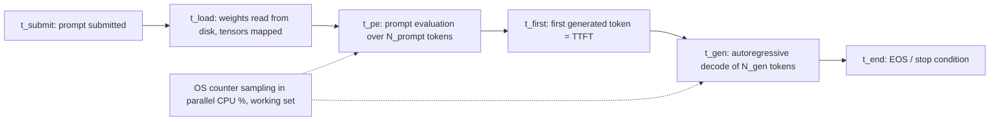

**Status:** THEORETICAL DESIGN — procedure defined, not yet executed.

# Lab05 – Measuring Local AI Performance

**Primary question:**
How do we define, measure, and record local LLM performance so that the numbers are reproducible on Environment A, comparable across later labs, and trustworthy enough to base decisions on?

## Purpose

This lab defines the measurement methodology for local AI performance, covering:
- precise performance metrics (latency, token counts, throughput, resource usage)
- the distinction between prompt evaluation rate and generation rate (llama.cpp reporting model)
- a measurement protocol: warmup runs, N repeated trials, fixed prompts and parameters
- Windows 11 built-in resource measurement (PowerShell `Get-Counter`, `typeperf`, Resource Monitor)
- the design of a reproducible results table that becomes the template for all later measurements

Topics reserved for later labs (not deeply explained here):
- quantization internals and size/speed trade-offs (Lab04)
- embeddings and similarity math (Lab06)
- chunking and retrieval latency (Lab07, Lab10)
- retrieval evaluation metrics such as precision/recall (Lab15)
- RAG observability and end-to-end tracing (Lab16)

**Explicitly stated:** This lab does **NOT** yet contain:
- embedding model
- vector store
- retriever
- RAG
- agents
- MCP

Only the LLM + inference runtime pair (studied in Lab01–Lab04) is measured here.

## Environment Assumptions

Observed facts (Environment A):
- **OS:** Windows 11
- **CPU:** Intel Core i7-4510U (2 cores / 4 threads)
- **RAM:** approximately 16 GB
- **Graphics:** Intel integrated graphics, no NVIDIA CUDA GPU
- **Execution mode:** CPU-only

These are observed facts, not hypotheses. Additional assumptions:
- No measurement tooling is installed yet; every install below is a *planned* step.
- A Q4-quantized 1B–3B model artifact is available by the time this lab runs (deliverable of Lab04).
- At least one runtime from Lab01/Lab02 is installed (Ollama and/or llama.cpp).

## Candidate Technologies

All are **candidates to be evaluated**, not decisions. All run on Windows 11 without heavy installs:

- **Ollama verbose timing output** — per-request timing fields (`load duration`, `prompt eval count`, `prompt eval duration`, `eval count`, `eval duration`, in nanoseconds) printed by `ollama run --verbose` or returned by the local API. Convenient, but self-reported by the runtime.
- **llama-bench** — llama.cpp's bundled benchmark binary; reports isolated prompt-processing (`pp`) and text-generation (`tg`) rates in tokens/s for a given GGUF file. Candidate for cross-validation.
- **llama.cpp verbose logs** — `llama-cli` / `llama-server` print `llama_print_timings:` lines (load time, prompt eval time/tokens, eval time/tokens). Lower-level view of the same quantities.
- **PowerShell `Get-Counter` / `typeperf`** — built into Windows 11; samples CPU (`\Processor(_Total)\% Processor Time`), per-process working set (`\Process(<name>)\Working Set`), and memory pressure counters, optionally logging to CSV.
- **Resource Monitor (`resmon`)** — built-in GUI for ad-hoc visual confirmation of CPU/RAM/disk behavior during a run.

Layering note: these tools *measure* the runtime; they are not the runtime, and not the model.

## Prerequisites

- [Lab01 – Running a Local LLM](../lab01-local-llm/README.md) — runtime installed, first inference achieved.
- [Lab02 – Understanding the Inference Runtime](../lab02-inference-runtime/README.md) — ability to invoke llama.cpp directly (for `llama-bench` / verbose logs).
- [Lab03 – Tokens, Context Windows and Generation Parameters](../lab03-tokens-context-generation/README.md) — why token counts (not characters) are the unit of work; fixed generation parameters (temperature, `n_predict`, seed) to hold constant.
- [Lab04 – Model Size and Quantization](../lab04-model-size-quantization/README.md) — selected model artifact, quantization level, and artifact size.
- [EXP01 – Local LLM CPU Baseline](../../experiments/exp01-local-llm-baseline/README.md) — its three fixed prompts are reused verbatim (Section "The measurement protocol").

## Theoretical Background

### 1. The inference timeline

Every local request passes through distinct phases, and each metric is anchored to one of them:

- **Model load time** `t_load`: wall-clock from issuing the run command until the runtime reports readiness. Includes reading the weight file from disk (or page cache), memory-mapping tensors, and allocating the KV cache. Large on first run after boot, small once the file is cached — which is why it is reported separately and measured after warmup.
- **Prompt evaluation time** `t_pe`: time to run the forward pass over all `N_prompt` input tokens ("prefill"). On CPU this phase exploits parallelism across the prompt.
- **Time to first token (TTFT)**: `TTFT = t_first − t_submit`, measured externally from the caller's side. It approximates `t_pe` plus queuing/IPC overhead; the runtime's internal `t_pe` and the externally observed TTFT are related but not identical — both are recorded.
- **Generation time** `t_gen = t_end − t_first`: the decode loop, one forward pass per newly generated token, strictly sequential.
- **Generated token count** `N_gen`: number of new tokens produced until EOS or the stop condition, as reported by the runtime logs (not estimated from characters).

### 2. Formulas (with variables defined)

Total request latency:
`T_total = t_end − t_submit = t_overhead + t_pe + t_gen` (after warmup, `t_load` is excluded from per-request latency and reported on its own)

- `T_total` — total wall-clock latency per request [s]
- `t_submit` — timestamp when the prompt is handed to the runtime [s]
- `t_end` — timestamp when the final token is returned [s]
- `t_overhead` — tokenization, IPC/HTTP, detokenization [s]

The two token rates (llama.cpp reports these as two separate numbers, and conflating them is the most common benchmarking mistake):

`R_pe = N_prompt / t_pe`  (prompt evaluation rate, tokens/s)
`R_gen = N_gen / t_gen`   (generation rate, tokens/s)

- `R_pe` — prompt throughput [tokens/s]; `N_prompt` — number of prompt tokens.
- `R_gen` — generation throughput [tokens/s]; `N_gen` — number of generated tokens.

Why `R_pe ≫ R_gen` in practice: prefill computes the forward pass for all prompt tokens together (larger, compute-efficient matrix operations), while decode is memory-bandwidth-bound — each of the 1B–3B parameters must be read from RAM for every single generated token, and on a CPU-only machine with ~25 GB/s theoretical memory bandwidth the weights stream becomes the bottleneck. Interactive usability is governed almost entirely by `R_gen` and TTFT, because the user watches tokens arrive one by one.

Statistics over `N` trials (proposed `N = 5`):

`x̄ = (1/N) Σᵢ xᵢ`        `s = sqrt( Σᵢ (xᵢ − x̄)² / (N − 1) )`

- `xᵢ` — value of a metric in trial `i`; `x̄` — sample mean; `s` — sample standard deviation; report min/max alongside.

Resource metrics:
- **CPU utilization** — raw counter `u_raw` from `Get-Counter` is summed over all logical processors (400% ceiling on 4 threads); normalized: `U = u_raw / L`, with `L = 4` logical processors, giving 0–100% of the machine.
- **Peak RAM** — the working set `W` (Windows analog of RSS) sampled at interval `Δt` during the run: `W_peak = max(W₁ … W_k)` [bytes]. Sanity relation to Lab04: `W_peak` should be on the order of `RAM_model ≈ (P × b / 8) + KV_cache + overhead`, where `P` = parameter count, `b` = bits per weight — a result far above this deserves investigation, not blind trust.

### 3. The measurement protocol

1. **Record the machine state first** (power plan, AC vs battery, notable background processes, pagefile settings) — these are confounders on a 2-core laptop.
2. **Warmup run(s)**, discarded: cold file/page cache, lazy one-time allocations, and thread-pool spin-up make the first run unrepresentative.
3. **Fixed prompts**: reuse EXP01's three prompts verbatim, to keep results comparable with the baseline experiment:
   1. Factual: *"What is the capital of France? Answer in one sentence."*
   2. Spanish: *"Explica en dos oraciones qué es un modelo de lenguaje."*
   3. Cybersecurity: *"Explain in two sentences why multi-factor authentication reduces account compromise risk."*
4. **N repeated trials** per prompt (proposed `N = 5`), recording every column of the results table each time.
5. **Fixed generation parameters** (temperature, `n_predict`, seed) held constant across trials; they change `N_gen` and therefore `R_gen`.
6. **External cross-validation**: at least one quantity (e.g. `R_gen`) is additionally measured by an independent tool (wall-clock + counter vs runtime-reported timings; `llama-bench` vs Ollama output) and compared against a stated tolerance (proposed: ±10%, a Decision to make when executing).

### 4. The reproducible results table (canonical template)

Columns (to be filled with measured values only — no placeholders left blank without a noted reason):

| Trial | Timestamp | Runtime + version | Model / quant / ctx | Prompt # | t_load [s] | t_pe [s] | TTFT [s] | N_gen | t_gen [s] | R_gen [tok/s] | R_pe [tok/s] | CPU U [%] | Peak RAM [GB] | Observations |
|-------|-----------|-------------------|--------------------|----------|-----------|----------|----------|-------|-----------|---------------|--------------|-----------|---------------|--------------|
| 1 | to be measured | | | | | | | | | | | | | |

Header block (record once per session): OS, CPU, RAM, runtime versions, power state, background-process notes, pagefile config.

This table is deliberately designed as the **template for all later measurements**: Phase 2 adds retrieval columns (`n_chunks`, index type) for retrieval latency (Lab10/Lab15); Phase 3 adds retrieval time and prompt-assembly time for end-to-end RAG latency (Lab16). Changing its core columns later would break comparability.

### 5. Pitfalls on this hardware (2-core laptop CPU)

- **Thermal throttling** — the i7-4510U is a 15 W part with limited turbo headroom; sustained all-core load heats the package until the clock drops, so later trials can be systematically slower than earlier ones. Planned countermeasures: cooldown pauses between trials, record trial order, inspect for monotonic slowdown trends.
- **Background processes** — with 2 physical cores, one busy process (Windows Defender scan, Windows Update, a browser tab) can halve throughput. We record what is running rather than pretending to have a sterile machine; unusual outliers are re-run and annotated.
- **Pagefile pressure** — once committed memory approaches RAM, hard page faults add orders-of-magnitude latency spikes. Watch `\Memory\Available MBytes` and `\Memory\Pages Input/sec` during trials.
- **Power plan and power source** — the "Balanced" plan and battery operation both reduce sustained clocks; state is recorded and held constant within a session.
- **Cold vs warm caches** — first load after boot reads the multi-hundred-MB weight file from disk; subsequent loads hit the page cache. Hence warmup, and hence `t_load` is reported separately from per-request latency.

## Hypothesis

**H05 (Working Hypothesis):** On Environment A (Windows 11, Intel Core i7-4510U, ~16 GB RAM, CPU-only), a 1B–3B parameter model in Q4 quantization achieves a sustained generation rate of `R_gen ≥ 3` new tokens/second. We propose this threshold as the working definition of "usable for interactive experimentation": at ~3 tok/s (roughly 2 words/s for English text) a short answer streams at a pace comparable to reading, so prompt → inspect → re-prompt cycles stay practical. This threshold is a project convention, not a hardware-derived constant; measurements in this lab will confirm or refute whether the hardware meets it, and repeated use will validate or revise the convention itself. Classification per LEARNING.md: Working Hypothesis.

## Procedure (Planned Steps)

All commands below are **planned, not yet executed**.

1. Confirm prerequisites: Labs 01–04 done; EXP01 prompt list at hand. Record runtime versions (e.g. `ollama --version`) — Observed.
2. Record machine state: power plan, AC/battery, background processes, pagefile settings — Observed.
3. Capture ~60 s of idle baseline counters to know the machine's floor noise (planned):
   `Get-Counter '\Processor(_Total)\% Processor Time' -SampleInterval 1 -MaxSamples 60`
4. Run one discarded warmup generation per EXP01 prompt.
5. For each of the 3 EXP01 prompts, run `N = 5` trials (planned): `ollama run <model> --verbose "<prompt>"`; in a second PowerShell window, sample during each run:
   `Get-Counter '\Process(ollama)\Working Set','\Processor(_Total)\% Processor Time' -SampleInterval 1` (or `typeperf ... -o counters.csv` for automatic CSV logging). Fill one results-table row per trial.
6. Repeat the slowest and fastest trial once each to check for thermal drift between early and late trials.
7. Cross-validate (planned): run the same GGUF via `llama-cli -m <model.Q4_K_M.gguf> -p "<prompt>"` and read the `llama_print_timings:` lines; run `llama-bench -m <model.Q4_K_M.gguf>` for isolated `pp`/`tg` rates. Compare against Ollama's reported values within the ±10% tolerance (proposed Decision).
8. Compute `x̄`, `s`, min, max per prompt; compare `R_gen` against the H05 threshold; mark H05 CONFIRMED or REFUTED in the journal.
9. Copy the filled table into EXP01 / `LEARNING.md` as a Measured Finding; document which pitfalls of Section 5 actually materialized.
10. Note what would be surprising and trigger re-measurement: near-zero variance across trials (suggests cached output rather than fresh inference), `R_gen` far above the memory-bandwidth expectation, `W_peak` vastly exceeding the Lab04 size estimate, or `llama-bench` disagreeing with runtime logs beyond the tolerance.

## Measurement / Success Criteria

Per the Evidence Classification in `LEARNING.md`:
- **Observed** — environment facts, runtime versions, machine state from step 1–2.
- **Measured Finding** — every completed row of the results table: a controlled measurement with quantified variables (hardware, model, quantization, context size, parameters, RAM/CPU usage, latency, tokens/s, inputs, outputs, observations). These rows are the lab's primary output.
- **Decision** — chosen toolset, the cross-validation tolerance, and the fate of the ≥3 tok/s threshold after measurement.
- **Working Hypothesis** — H05, until the data above confirms or refutes it.

Completion checklist:
- [ ] All 3 prompts × 5 trials recorded; no unexplained blank cells.
- [ ] `R_gen` mean, sample std dev, min, max computed per prompt.
- [ ] CPU utilization and peak working set recorded per trial.
- [ ] At least one metric cross-validated by two independent tools within the stated tolerance.
- [ ] H05 explicitly marked CONFIRMED or REFUTED with the supporting numbers.
- [ ] Pitfalls from Section 5 that actually occurred are documented.
- [ ] Results transferred to `LEARNING.md` as Measured Finding(s).

## Security Analysis

Trust boundaries introduced or crossed in this lab:
- **TB1** — External source → local machine: the benchmark binaries (`llama-bench`, Ollama installer) and the model artifact arrive over the network. Measured numbers are only meaningful if the artifact is the intended one; a tampered runtime could also *misreport* its own timings. (Connects to Lab22 – Model Provenance and Supply Chain.)
- **TB2** — Runtime process → OS measurement channel: `Get-Counter`/`typeperf`/ETW read per-process counters across a process boundary, requiring privileges. The measurement channel itself is part of the attack surface (and historically a source of Windows vulnerabilities).
- **TB3** — Local results/logs → anywhere else: timing logs, CSV counter dumps, and the results table embed prompt text (including the EXP01 prompts), model paths, hostname, and username. Publishing or sharing them leaks that metadata.
- **TB4** — Runtime → measurement consumer: self-attestation. Runtime-reported timings come from the very component being evaluated; cross-validation with external wall-clock and OS counters is the planned control, not an optional extra.

Attack surface specific to this mechanism:
- Executing downloaded benchmark binaries with user privileges (supply-chain exposure of the measurement tooling itself).
- Accumulation of sensitive prompt text in verbose logs and CSV files at rest on disk.
- Timing/counter channels are bidirectional side channels: co-resident processes pollute our measurements, and precise counters can reveal co-resident activity on a shared machine.

Open questions (no validated mitigations yet — mitigations are evaluated in Phase 4):
- Do the Ollama / llama.cpp builds used here auto-update or emit telemetry during "local" runs? How can this be verified cheaply (netstat during a session)?
- How large is the observer overhead of 1 s counter sampling on a 2-core machine — does measuring change the measurement?
- Can thermal state be quantified on this machine without installing additional tools?
- What exact tolerance should count as "agreement" between independent tools (proposed ±10%)?

## Learning Objectives

At the end of this lab, we should be able to explain:
1. The full latency timeline of a local inference request and where each metric is anchored on it.
2. The difference between prompt evaluation rate and generation rate, and why the latter governs interactive usability.
3. Why llama.cpp-style runtimes report two distinct tokens-per-second numbers.
4. How warmup runs, repeated trials, and fixed prompts/parameters reduce variance — and how much variance remains on a thermally constrained CPU.
5. How to sample CPU utilization and working set on Windows 11 using only built-in tools.
6. How to structure a results table so it stays comparable when reused for retrieval latency (Lab10/Lab15) and end-to-end RAG latency (Lab16).
7. What distinguishes a Measured Finding from an Observed fact under the Evidence Classification in `LEARNING.md`.
8. Why runtime-reported timings are self-attestation, and how external cross-validation addresses that.
9. How the act of measuring itself creates logs and metadata with security implications (TB3, TB4).

---

**Previous lab:** [Lab04 – Model Size and Quantization](labs/lab04-model-size-quantization/README.md)
**Next lab:** [Lab06 – Embeddings and Similarity](labs/lab06-embeddings-similarity/README.md)

*This document is part of the local-ai-security-lab repository.*
